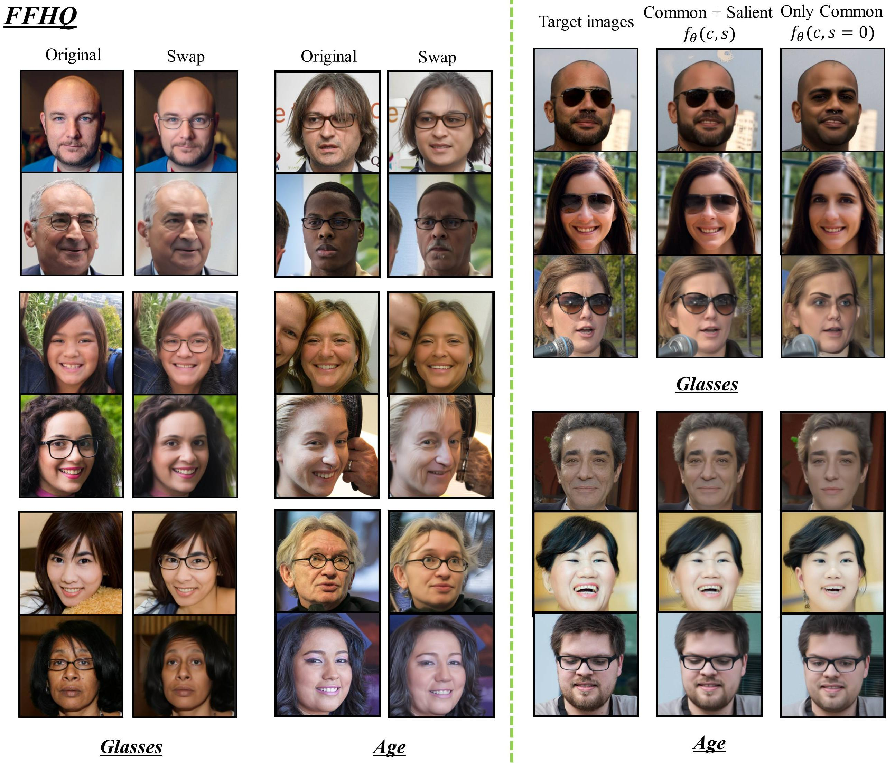

# Asyrp-h_space
**Unsupervised Image Editing via the Latent Space of Diffusion Models**

This repository contains **`part`** of the implementation for the paper:
**"Learning Common and Salient Generative Factors Between Two Image Datasets"**.

We have now submitted it to AAAI-26 for review!

Our method is inspired by the idea proposed in  
[*Diffusion Models Already Have a Semantic Latent Space* (ICLR 2023)](https://arxiv.org/abs/2210.10960).

## Overview


## Results

Here is based on Swap editing of the Glasses attribute and Age attribute in the FFHQ dataset.


Here is based on Swap editing of the Gender attribute and Smile attribute in the CelebA dataset.


## Training

To start training, run the following command:

```bash
python training_scripts/train.py \
  --exp_scheme=specific_encoder_fused \
  --results_dir=results/your_dir \
  --cs_net_type=specific_conv_fused \
  --n_cs_layers=12 \
  --t_end_edit=0 \
  --n_inv_step=100 \
  --lr_mlp=0.00001 \
  --dataset_type=ffhq_glasses \
  --diffu_weights=pretrained_models/ffhq_p2.pt \
  --diffu_config_path=configs/ffhq.yml \
  --image_interval=50 \
  --val_interval=9999999 \
  --save_interval=100 \
  --batch_size=16 \
  --dataset_root=your_data_dir
```

### Parameter Notes
--results_dir: Path to save all intermediate results and model checkpoints.

--n_cs_layers: Number of layers in the Mapping Network.

--t_end_edit: Time step at which editing ends during the diffusion process.

--n_inv_step: Number of denoising steps used in the inversion process.

--image_interval: Interval (in steps) to save intermediate visualization results.

--save_interval: Interval (in steps) to save model checkpoints.

--diffu_weights: Path to the pretrained diffusion model weights.

--diffu_config_path: Path to the diffusion model configuration YAML file.

--dataset_type: Type of editing task (e.g., ffhq_glasses).

--dataset_root: Path to your local training data directory.


### Important Notes
1. The Mapping Network architecture shown in the figure above achieves the best editing results based on our experiments.

2. Before training, please download the pretrained diffusion model from
https://github.com/kwonminki/Asyrp_official
and place the model file in the pretrained_models/ directory.

3. To reduce training time and ensure efficiency, we do not evaluate on the test set during training, as test metrics are not reliable indicators of editing quality at a given iteration.

## Inference

To perform inference using a trained model checkpoint, run:

```bash
python training_scripts/inference.py \
  --exp_scheme=specific_encoder_fused \
  --results_dir=save_results_dir \
  --cs_net_type=specific_conv_fused \
  --cs_model_weights=your_checkpoints_dir/iteration_3500.pt \
  --n_cs_layers=12 \
  --t_end_edit=0 \
  --dataset_type=ffhq_glasses \
  --diffu_weights=pretrained_models/ffhq_p2.pt \
  --diffu_config_path=configs/ffhq.yml \
  --n_inv_step=100 \
  --batch_size=16 \
  --dataset_root=your_data_dir
```

### Inference Tips

You can use the final.pt model checkpoint from the training phase to perform inference directly.

However, we recommend training a lightweight classifier on the same dataset to evaluate whether the target attribute (e.g., glasses) has been successfully modified.

Use the classifier to assess multiple checkpoints and select the one with the highest editing accuracy for inference.


### citation
Thank you for trying our project! 

The StyleGAN-related code used in this project can be found at: **`www.xxx.com`**

If you find this project helpful, please consider citing our paper **`(coming soon)`**.

Feel free to ⭐️ the repo and reach out with any issues or suggestions.
